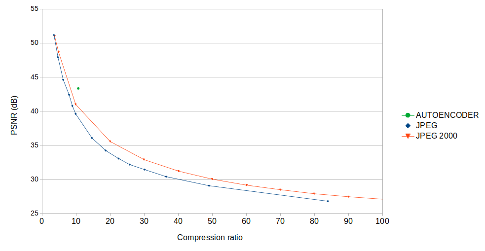

# Using autoencoders to compress and restore facial images

The aim of this project is to experiment with deep learning autoencoders for different purposes:
- [Compressing face images](#Face images compressor)
- [Damage repair](pyramidal/README.md)
- [Colorization](colorization/README.md)
- [Super-resolution](https://github.com/calebemonteiro/AIDL_Project/blob/master/README.md)


# Getting the source code

This project contains git submodules, so in order to download the source you need to clone with the "--recursive" switch:

```git clone  git@github.com:abel-bernabeu/autoencoder.git --recursive```

# Face images compressor

This section describes the implementation and training of a compressive
autoencoder tailored for the domain of human face images.

A Jupyter notebook that scripts the experiments described in this report
is available in the facecompressor GitHub repo (see
[here](https://github.com/abel-bernabeu/facecompressor/blob/master/train.ipynb)). This document
is a reading companion for that notebook, where the work was originally
developed.

In this report we start describing the dataset used for our experiments.
Then we develop a series of seven experiments leading to a final functional
compressing model. In each of those experiments we craft an incrementally
functional prototype or we test a different idea. For each experiment we
do:

- Describe the purpose.
- Specify the hyper parameters (hparams).
- Summarize the experiment results (collected from the corresponding
  TensorBoard instance embedded in the training notebook).

## Compiled dataset

The dataset used in the following experiments is based on VoxCeleb2.
The VoxCeleb2 dataset contains 224x244 sized videos of human faces.
The videos are organized in four levels of directories:

- The top level splits the dataset in "dev" and "test" partitions,
  ensuring that no identity from one partition is present in the
  other. This partition level is important for ensuring there is
  no data leakage from the test to the train set.  

- For each dataset partition there are a number of directories, one
  per each unique person identity.
  
- A third level consists of videos from the identities, like for
  example a broadcasted TV interview.
 
- The fourth and last level contains, for a given video, clips
  of several seconds (typically less than ten seconds) where the
  person face covers and perfectly fits each 224x224 frame. These
  clips are commonly referred as utterances.

As a training set for the autoencoders in these experiments we
compiled a training set with 60K frames belonging to 50K randomly
selected utterances from the whole VoxCeleb2 dev partition. For a
given randomly selected utterance we sample for the train set the
first frame and one more frame every ten seconds. With most videos
being typically shorter than ten seconds that means to pick one
frame per video.

Note that by picking our utterances randomly be ensure a good
coverage of the whole set of person identities.

The test set is compiled following a similar approach. A total
of 6K frames is picked for the test set by sampling from 5K
randomly selected utterances from the test VoxCeleb2
partition.

The data subset compilation process can be repeated by downloading
VoxCeleb2 and running the 
[image_dataset.ipynb](https://github.com/abel-bernabeu/facecompressor/blob/master/autoencoder/tools/image_dataset.ipynb)
 Jupyter notebook. Our resulting
compiled dataset can be downloaded from
[here](https://www.dropbox.com/s/n03i55xxwqnned4/image_dataset.zip?dl=0).


## Experiment 1: sparsity at 1/2

Our baseline model effort focuses on training the neural network proposed in "Lossy image compression with compression autoencoders", by Lucas Theis, Wenzhe Shi, Andrew Cunningham & Ferenc Husz, published in 2017 (see the [original paper](https://arxiv.org/pdf/1703.00395v1.pdf) for details). We make the addition of batch normalization layers for improved robustness, but other than that we try to stick to the proposed model as much as possible.

The purpose of this experiment is to confirm that we have understood the architecture, and confirm that we can extract features and use them for reconstructing the original image.

The paper authors claim that their "subpixel" operator is a better upsampler than transposed convolution, because it does not suffer from the checker board artifact produced by the kernel overlaps (see [this blog post](https://distill.pub/2016/deconv-checkerboard/) for illustrated examples). This a bold clain that needs, at least, a visual confirmation.

For this first experiment we will not implement any kind of quantization and we will only perform a 50% dimensionality reduction (sparsity from now on). This dimensionality reduction is achieved by using 96 channels in the features tensor (as opposed to 192 channels that would be needed if we wanted to keep the dimensionality from the input).
 
|  Hyper parameter           | Value |
|----------------------------|-------|   
|  batch_size                | 32    | 
|  lr                        | 1e-6  |
|  device                    | 'cuda'|
|  block_width               | 128   |
|  block_height              | 128   |
|  hidden_state_num_channels | 96    |
|  quantize                  | False |
|  num_bits                  | 0     |
|  train_dataset_size        | 5000  |
|  test_dataset_size         | 500   |
|  num_epochs                | 12577 |
|  num_workers               | 4     |
|  name                      | "experiment1"|
|  port                      | 6100         |
|  checkpointing_freq        | 10           |
|  inference_freq            | 200          |

### Results

We see there is no blurriness, which is very pleasant to see. The subpixel operator certainly delivers a sharp reconstruction.

The quality of this model sets 43 dB as upper bound on the accuracy for this model. The quality measurement will not get any better as we try smaller sparsity ratios in the next experiments

Training the model took 4 days on a Tesla P100, setting also a lower bound on how long will take us to train state of de art models for image compression.

## Experiment 2: sparsity at 1/4

In this second experiment we further squeeze the features tensor, going from 96 channels to only 48 for achieving a 25% dimensionality reduction to confirm the images can be further squeezed without serious damage. We define a serious damage a PSNR for the test set below 32 db.

Again no quantization is provided.

|  Hyper parameter           | Value |
|----------------------------|-------|   
|batch_size' | 40
|lr' | 1e-6
|device' | 'cuda'
|block_width' | 224
|block_height' | 224
|hidden_state_num_channels  | 48
|quantize' | False
|num_bits' | 0
|train_dataset_size  | 1000
|test_dataset_size | 500
|num_epochs | 16000
|num_workers | 4
|name | "experiment2"
|port | 6200
|checkpointing_freq | 10
|inference_freq | 200

### Results

We see training reaching a 32 dB PSNR for the test set in just 31 hours of training, with the slope suggesting the quality is far from stagnated.

##  Experiment 3: 3 bits quantization

On this third experiment we introduce 3 bits quantization of the features. This experiment is intended to empirically prove the suitability of a novel concept for training a quantizing model, which we call **training in two stages**:

1. A quantizing model is trained with the quantization and dequantization modules being bypassed.

2. The quantizing model in trained with the encoder weights frozen and the quantization and dequantization modules enabled, with the purpose of training the decoder for undoing the quantization.

|  Hyper parameter           | Value |
|----------------------------|-------|   
|batch_size' | 40 |
|lr | 1e-6 |
|device  | 'cuda'
|block_width  | 224
|block_height  | 224
|hidden_state_num_channels | 48
|quantize | True
|num_bits | 3
|train_dataset_size | 1000
|test_dataset_size | 500
|num_epochs | 2500
|num_workers | 4
|name | "experiment3"
|port | 6300
|checkpointing_freq | 10
|inference_freq | 200

## Results

The test PSNR improves about 0.2 dB, showing that the decoder can learn to undo some of the noise introduced by the quantization.

### Experiment 4: sparsity at 1/8

At this point it becomes evident that if we want to achieve a compression ratio in the range of 1/10 to 1/20 for comparing with JPEG and JPEG 2000, it is unlikely that using a 1/4 sparsity is bringing us even nearly close, no matter what the PSNR the image codec is.

Although we can certainly try to rely on quantization and entropic coding for bridging the compression ratio gap from 1/4 to 1/10, it seems a bit of a stretch to say the least. Achiving a sparsity of 1/8 on the autoencoder would be a better starting point for the quantization and entropy coding effort to bridge the gap with JPEG. 

Hence, in this experiment we train a model that reduces dimensionality to 1/8, although but we do not yet perform  quantization. We do not introduce quantization yet because we learned in experiment 3 that it is possible to first train without quantization and then introduce the quantization on a second stage.

|  Hyper parameter           | Value |
|----------------------------|-------|   
|batch_size | 40
|lr | 1e-6
|device | 'cuda'
|block_width | 224
|block_height | 224
|hidden_state_num_channels | 24
|quantize | False
|num_bits | 0
|train_dataset_size | 1000
|test_dataset_size | 500
|num_epochs | 110000
|num_workers | 4
|name | "experiment4"
|port | 6400
|checkpointing_freq | 10
|inference_freq | 200

## Results

The test PSNR is 40.1 dB, but could only achieve this result at the expense of training for 14 days on an Tesla P100 (with a approximated cost of 350 euros in Google Cloud Platform).

### Experiment 5: 6 bits quantization

We do the second stage of training the quantizing model, expecting to confirm once again that the training in two stages helps to reduce the amount of noise introduced by the quantization.

Similarly to what it was done for experiment 3, the second stage of the training is achieved is by transferring the encoder and decoder weights learned with experiment 4, freezing the encoder weights and further training the decoder for undoing the quantization.

|  Hyper parameter           | Value |
|----------------------------|-------|   
|batch_size | 40
|lr | 1e-8
|device | 'cuda'
|block_width | 224
|block_height | 224
|hidden_state_num_channels | 24
|quantize | True
|num_bits | 6
|train_dataset_size | 1000
|test_dataset_size | 500
|num_epochs | 12650
|num_workers | 4
|name | "experiment5"
|port | 6500
|checkpointing_freq | 10
|inference_freq | 200

### Results

Adding the quantization worsened the test PSNR: went from 40.1 dB to 39.7 dB. However, by further training the decoder we improved the test PSNR from 39.7 dB to 39.9 dB.

## Experiment 6: blending in more training data

In this experiment we try a radically different approach for training the same model from experiment 4. Rather than running for as many epochs as possible (110K in experiment 4) we do fewer epochs with an increased dataset size (60K samples as opposed to 1K samples in experiment 4) and an increased learning rate.

|  Hyper parameter           | Value |
|----------------------------|-------|   
|batch_size | 40
|lr | 2e-5
|device | 'cuda'
|block_width | 224
|block_height | 224
|hidden_state_num_channels | 24
|quantize | False
|num_bits | 0
|train_dataset_size | 60000
|test_dataset_size | 6000
|num_epochs | 960
|num_workers | 4
|name | "experiment6"
|port | 6600
|checkpointing_freq | 10
|inference_freq | 200

### Results

The approach really pays off, achieving higher accuracy with just 5 days of training (a opposed to 14 days in experiment 4).

## Experiment 7: 6 bits quantization of final model

In this experiment we introduce a 6 bits quantization in the model from experiment 6. For the training we used only 12 additional hours of a Tesla P100.

|  Hyper parameter           | Value |
|----------------------------|-------|   
|batch_size | 40
|lr | 1e-8
|device | 'cuda'
|block_width | 224
|block_height | 224
|hidden_state_num_channels | 24
|quantize | True
|num_bits | 6
|train_dataset_size | 60000
|test_dataset_size | 6000
|num_epochs | 350
|num_workers | 4
|name | "experiment7"
|port | 6700
|checkpointing_freq | 10
|inference_freq | 200

### Results

A 6 bits quantization needed for increasing the compression ratio to 10.66 was introduced, which impacted the PSNR (going from 44.02 dB to 43.08 dB). Then the decoder was trained for removing that noise and went from 43.08 dB to 43.4 dB.

## Final conclusions

The training in two stages technique proposed in this technical report, in spite of its simplicity, is a valid strategy for dealing with quantization layers during training.

The model from experiment 7 is our best choice so far (achieving a 10.6 compression ratio with a 43.4 dB PSNR).
For seeing this result in perspective one needs to look at the PSNR for an equivalent compression ratio with standard compression methods like JPEG and JPEG 2000.

The best data source we could find for this comparison was from "JPEG vs. JPEG2000: An Objective Comparison of Image Encoding Quality", by Farzad Ebrahimi, Matthieu Chamik and Stefan Winkler, published in 2004. That paper, in its figure 10, benchmarks JPEG and JPEG2000 jointly plotting curves of PSNR per compression ratio for two popular implementations. We extracted the data by reverse engineering the figure and plotted our best choice result altogether with the original curves.



Seeing this graph one can see that in terms of image quality, the tried architecture outperforms JPEG and JPEG 2000. Therefore, speed considerations apart, there seem to be potential for deep neural networks to be adopted for image compression.

Finally, it may be argued that training the model for the specific domain of human faces may have pushed up our PSNR. However, our setup also suggests that tailoring the training for a specific domain is valid strategy for addressing the needs of niche markets. 
