# Using autoencoders to compress and restore facial images

The aim of this project is to experiment with deep learning autoencoders for different purposes:
- [Compressing face images](#compressing-face-images)
- [Pyramidal Architectures for Image Restoration](#pyramidal-architectures-for-image-restoration)
- [Colorization](colorization/README.md)
- [Super-resolution](https://github.com/calebemonteiro/AIDL_Project/blob/master/README.md)


# Getting the source code

This project contains git submodules, so in order to download the source you need to clone with the "--recursive" switch:

```git clone  git@github.com:abel-bernabeu/autoencoder.git --recursive```

# Compressing face images

This section describes the implementation and training of a compressive
autoencoder tailored for the domain of human face images.

A Jupyter notebook that scripts the compression experiments described in this report
is available in the facecompressor GitHub repo (see
[here](https://github.com/abel-bernabeu/facecompressor/blob/master/train.ipynb)). This document
is a reading companion for that notebook, where the work was originally
developed.

In this report we start describing the dataset used for our experiments.
Then we develop a series of seven experiments leading to a final functional
compressing model. In each of those experiments we craft an incrementally
more functional prototype or we test a different idea. For each experiment we
do:

- Describe the purpose.
- Specify the hyper parameters (hparams).
- Summarize the relevant results collected from a TensorBoard instance embedded
  in the training notebook). The results are values of PSNR (Peak Signal to
  Noise Ratio) for the test set, visualizations of the reconstructed images for
  a handful of test samples or depictions of the error at the pixel level.
  
Note that PSNR and MSE (Mean Square Error) are equivalent in the sense
that optimizing for the highest PSNR is equivalent to doing it for lowest MSE.
In this document we prefer to talk in terms of PSNR just because it is a more
common metric in image quality benchmarks. 

## Compiled dataset

The dataset used in the compression experiments is based on 
[VoxCeleb2](http://www.robots.ox.ac.uk/~vgg/data/voxceleb/vox2.html).
The VoxCeleb2 dataset contains 224x244 sized videos of human faces.
The videos are organized in four levels of directories:

- The top level splits the dataset in "dev" and "test" partitions,
  ensuring that no identity from one partition is present in the
  other. This partition level is important for ensuring there is
  no data leakage from the test to the train set.  

- For each dataset partition there are a number of directories, one
  per each unique person identity.
  
- A third level consists of videos from the identities, like for
  example a broadcasted TV interview.
 
- The fourth and last level contains, for a given video, clips
  of several seconds (typically less than ten seconds) where the
  human face fits the 224x224 frame. These clips are commonly
  referred as utterances.

As a training set for the autoencoders in these experiments we
compiled a training set with 60K frames belonging to 50K randomly
selected utterances from the whole VoxCeleb2 "dev" partition. For the
test we randomly pick utterances (videos). Then for each of the picked
videos we extract the first frame and one more frame every ten seconds.
Since most videos are typically shorter than ten seconds that means
to pick one just frame per video. Note that by picking our utterances
randomly be ensure a good coverage of the whole set of person identities.

The test set is compiled following a similar approach. A total
of 6K frames is picked for the test set by sampling from 5K
randomly selected utterances from the test VoxCeleb2
partition.

The data subset compilation process can be repeated by downloading
VoxCeleb2 and running the 
[image_dataset.ipynb](https://github.com/abel-bernabeu/facecompressor/blob/master/autoencoder/tools/image_dataset.ipynb)
 Jupyter notebook. The resulting
compiled dataset can be downloaded from
[here](https://www.dropbox.com/s/n03i55xxwqnned4/image_dataset.zip?dl=0).


## Experiment 1: sparsity at 1/2

Our baseline effort focuses on training the neural network proposed in "Lossy image compression with compression autoencoders", by Lucas Theis, Wenzhe Shi, Andrew Cunningham & Ferenc Husz, published in 2017 (see the [original paper](https://arxiv.org/pdf/1703.00395v1.pdf) for details).

We make the addition of batch normalization layers for improved robustness, but other than that we try to stick to the proposed model as much as possible.

The purpose of this experiment is to confirm that we have understood the architecture, and confirm that we can extract features and use them for reconstructing the original image.

The decoder includes an operator the paper authors call "subpixel", consisting on a regular
convolution (as opposed to transposed) followind by a pixel shuffle. The paper authors
claim that their "subpixel" operator is a better upsampler than transposed convolution.
It is clamed that subpixel operations do not suffer from the checker board artifacts
produced by the kernel overlaps on transposed convolutions (see
[this blog post](https://distill.pub/2016/deconv-checkerboard/) for illustrated examples
of checker board artifacts). This a bold claim that needs, at least, a visual
confirmation.

For this first experiment we will not implement any kind of quantization and we will only perform a 50% dimensionality reduction (sparsity from now on). This dimensionality reduction is achieved by using 96 channels in the features tensor (as opposed to 192 channels that would be needed if we wanted to keep the dimensionality from the input).

We train with patches of 128x128, as the paper authors did, even though the model can
support any input size because it is defined in terms of operators like convolution that
do not assume any specific input size. Other relevant training choices are collected in
the following hyperparameters are table. In this experiment (and all the seqsequent ones)
we train using the Adam optimizer.
 
|  Hyper parameter name      | Value |   Description    
|----------------------------|-------|---------------
|  batch_size                | 32    |  Batch size 
|  lr                        | 1e-6  |  Learning rate
|  block_width               | 128   |  Input block width
|  block_height              | 128   |  Input block height
|  hidden_state_num_channels | 96    |  Number of channels in the features tensor
|  quantize                  | False |  Whether quantization is enabled for the features
|  num_bits                  | 0     |  The number bits when quantizing, ignored otherwise
|  train_dataset_size        | 5000  |  Number of frames from the "dev" partition used for training
|  test_dataset_size         | 500   |  Number of frames from the "test" partition used for computing the test error and test PSRN
|  num_epochs                | 12577 |  Number of epochs done during training

### Results

We see there is no blurriness, which is very pleasant to see. The subpixel operator certainly delivers a sharp reconstruction.

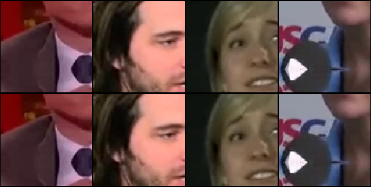

The quality of this model sets 43 dB as upper bound on the accuracy for this architecture. The quality measurements will not get any better as we try smaller sparsity ratios in the next experiments

Training the model took 4 days on a Tesla P100, setting also a lower bound on how long will take us to train state of the art models for image compression.

## Experiment 2: sparsity at 1/4

In this second experiment we further shrink the features tensor, going from 96 channels to
only 48 for achieving a 25% dimensionality reduction. The purpose of the experiment is just
to confirm the images can be further shriked without serious damage. We define a serious
damage as a PSNR for the test set below 32 dB.

Again no quantization is provided. The input patch size is changed to 224x224 to match the dataset frame size, just for making the visualization a bit nicer.

|  Hyper parameter name      | Value |
|----------------------------|-------|
|batch_size' | 40
|lr' | 1e-6
|block_width' | **224**
|block_height' | **224**
|hidden_state_num_channels  | **48**
|quantize' | False
|num_bits' | 0
|train_dataset_size  | 1000
|test_dataset_size | 500
|num_epochs | **16000**

### Results

We see training reaching a 32 dB PSNR for the test set in just 31 hours of training, with the slope suggesting the quality is far from stagnated.

##  Experiment 3: 3 bits quantization

On this third experiment we introduce 3 bits quantization of the features. This experiment is intended to empirically prove the suitability of a novel concept for training a quantizing model, which we call **training in two stages**:

1. A quantizing model is trained with the quantization and dequantization modules being bypassed.

2. The quantizing model in trained with the encoder weights frozen and the quantization and dequantization modules enabled, with the purpose of training the decoder for undoing the quantization.

|  Hyper parameter name      | Value |
|----------------------------|-------|
|batch_size | 40
|lr | 1e-6
|block_width  | 224
|block_height  | 224
|hidden_state_num_channels | 48
|quantize | **True**
|num_bits | **3**
|train_dataset_size | 1000
|test_dataset_size | 500
|num_epochs | **2500**

### Results

The test PSNR improves about 0.2 dB as shown in the following figure.

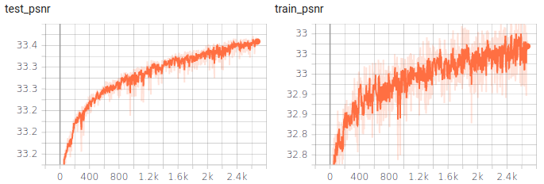

A very interesting conclusion is that **the decoder can actually learn to undo some of the noise introduced by the quantization***,
confirming our experiment hypothesis.


## Experiment 4: sparsity at 1/8

At this point it becomes evident that if we want to achieve a compression ratio
in the range of 1/10 to 1/20 for comparing with JPEG and JPEG 2000, it is
unlikely that using a 1/4 sparsity is bringing us even nearly close, no matter
how high our reconstruction PSNR is.

Although we can certainly try to rely on quantization and entropic coding for
bridging the compression ratio gap from 1/4 to 1/10, it seems a bit of a
stretch to say the least. Achieving a sparsity of 1/8 on the autoencoder would
be a better starting point for the quantization and entropy coding effort to
bridge the gap with JPEG.

Hence, in this experiment we train a model that reduces dimensionality to 1/8,
although but we do not yet perform  quantization. We do not introduce quantization
yet because we learned in experiment 3 that it is possible to first train without
quantization and then introduce the quantization on a second stage.

Notice in the following table the hyper parameter values in bold typography, which are the ones whose values changed from previous experiment.

|  Hyper parameter name      | Value |
|----------------------------|-------|
|batch_size | 40
|lr | 1e-6
|block_width | 224
|block_height | 224
|hidden_state_num_channels | **24**
|quantize | **False**
|num_bits | **0**
|train_dataset_size | 1000
|test_dataset_size | 500
|num_epochs | **110000**

### Results

The test PSNR is 40.1 dB which still allows for sharp reconstructions. However, we could only achieve this result at
the expense of training for 14 days on an Tesla P100  (with an approximated cost of 350 euros in Google Cloud Platform).
The training cost is really going up as we push boundaries.

Remember that in experiment 1 where we aimed at a 1/2 sparsity we could achieve a high PSNR of 43 dB in only 4 days of
training. From now on we should start being mindful of the economic cost of the experiments.

## Experiment 5: 6 bits quantization

We do the second stage of training the quantizing model, expecting to confirm once again that the training in two stages helps to reduce the amount of noise introduced by the quantization.

Similarly to what it was done for experiment 3, the second stage of the training is achieved is by transferring the encoder and decoder weights learned with experiment 4, freezing the encoder weights and further training the decoder for undoing the quantization.

|  Hyper parameter name      | Value |
|----------------------------|-------|
|batch_size | 40
|lr | **1e-8**
|block_width | 224
|block_height | 224
|hidden_state_num_channels | 24
|quantize | **True**
|num_bits | **6**
|train_dataset_size | 1000
|test_dataset_size | 500
|num_epochs | **12650**

### Results

Adding the quantization worsened the test PSNR: went from 40.1 dB to 39.7 dB. However, by further training the decoder we improved the test PSNR from 39.7 dB to 39.9 dB.

## Experiment 6: blending in more training data

In this experiment we try a radically different approach for training the same model from experiment 4. Rather than running for as many epochs as possible (110K in experiment 4) we do fewer epochs with an increased dataset size (60K samples as opposed to 1K samples in experiment 4) and an increased learning rate.

|  Hyper parameter name      | Value |
|----------------------------|-------|
|batch_size | 40
|lr | **2e-5**
|block_width | 224
|block_height | 224
|hidden_state_num_channels | 24
|quantize | False
|num_bits | 0
|train_dataset_size | **60000**
|test_dataset_size | **6000**
|num_epochs | **960**

### Results

The approach really pays off, achieving higher accuracy with just 5 days of training (a opposed to 14 days in experiment 4).

## Experiment 7: 6 bits quantization of final model

In this experiment we introduce a 6 bits quantization in the model from experiment 6. For the training we used only 12 additional hours of a Tesla P100.

|  Hyper parameter name      | Value |
|----------------------------|-------|
|batch_size | 40
|lr | **1e-8**
|block_width | 224
|block_height | 224
|hidden_state_num_channels | 24
|quantize | **True**
|num_bits | **6**
|train_dataset_size | 60000
|test_dataset_size | 6000
|num_epochs | **350**

### Results

In the following graph we see test and train PSNR, with the test PSRN peaking at
43.4 dB right before the end of the 350 epochs of the experiment.

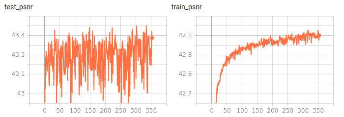

In the following image mosaic we depict the input (top row), output (middle row) and 
error (bottom row) for a few test samples. The error images are a depiction
of the ground truth minus the reconstructed image. For every RGB component we applied
the formula "max(0, min(1, 8 x + 1/2))". Note that with this color palette a pixel with
zero error is depicted as pure gray.

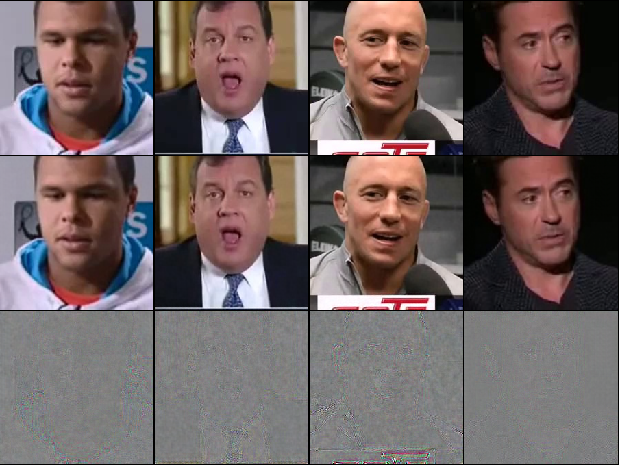

A 6 bits quantization needed for increasing the compression ratio to 10.66 was introduced, which impacted the PSNR (going from 44.02 dB to 43.08 dB). Then the decoder was trained for removing that noise and went from 43.08 dB to 43.4 dB.
The resulting images look sharp, in line with the high PSNR values.


## Final conclusions

The training in two stages technique proposed in this technical report, in spite of its simplicity, is a valid strategy for dealing with quantization layers during training.

The model from experiment 7 is our best choice so far (achieving a 10.6 compression ratio with a 43.4 dB PSNR).
For seeing this result in perspective one needs to look at the PSNR for an equivalent
compression ratio with standard compression methods like JPEG and JPEG 2000.

The best data source we could find for this comparison was from "JPEG vs. JPEG2000:
An Objective Comparison of Image Encoding Quality", by Farzad Ebrahimi,
Matthieu Chamik and Stefan Winkler, published in 2004. That paper, in its figure 10,
benchmarks JPEG and JPEG2000 jointly plotting their PSNR per compression ratio curves. 
We extracted the data by reverse engineering the figure and plotted our best choice result altogether with the original curves.


Seeing this graph one can see that in terms of image quality, the tried architecture outperforms JPEG and JPEG 2000. Therefore, speed considerations apart, deep neural networks have potential for being adopted in image compression.

Finally, it may be argued that training the model for the specific domain of human faces may have pushed up our PSNR. However, our setup also suggests that tailoring the training for a specific domain is a valid strategy for addressing the needs of niche markets.

# Pyramidal Architectures for Image Restoration

## Hypothesis

> We think that pyramidal architectures in autoencoders can work well for image restoration, can’t they?

The figure below shows what a pyramidal autoencoder looks like:


The encoder is made of several convolutional stages that progressively downsample the damaged (noise, holes, blurring, etc) input image size and produce a bottleneck of features that the decoder uses to reconstruct the undamaged ground truth image. The key point of the pyramidal architecture is the skip connections that flow from the encoder to the decoder after each intermediate stage to help the flow of features at different resolution levels:

* The shallow paths learn local features at pixel neighborhood level.
* The deep paths learn abstract features with large receptive field at image size level.
* And all of them collaborate to restore the ground truth image.

## Summer break experiments & conclusions

To verify our hypothesis, we designed and trained several pyramidal models and compared them to their basic nonpyramidal counterparts. All of these models can be found inside /pyramidal/autoencoders: basic21.py, basic22.py, basic51.py, basic51.py, pyramidal51.py, pyramidal51cat.py and pyramidal52.py.

Some results of these models are shown and commented below:

### Ground Truth


 
### Input Image

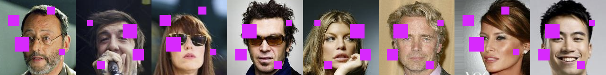 

### Basic21 model

 
 
This is a non-pyramidal shallow model. Pixel details are well captured but larger structures like the purple squares cannot be reconstructed because of the lack of enough receptive field. This model could work for restoring small noise but not this.

### Basic51 model

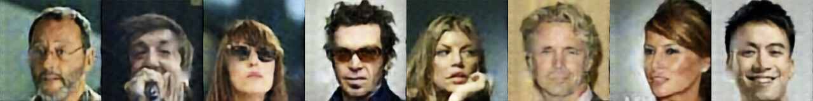 
 
This is a non-pyramidal deep model. Now we have an enough large receptive field to restore the purple boxes completely, but the bottleneck of features is so deep that we loss pixel level details

### Pyramidal51 model

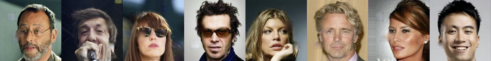 

Finally, this is a pyramidal model. It has a large receptive field but also performs good reconstruction at the fine pixel level details. In short, it combines the benefits of Basic21 and Basic51 in a single model.

These results confirm our hypothesis about the benefits of using pyramidal architectures in autoencoders.

## New hypothesis

But what would happen if we had more massive damages into the input images like these ones?

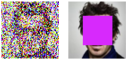 
 
In this case, we need more convolutional layers in our model for being able to learn more but, the more layers, the greater the vanishing gradient problem:
 
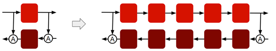 

So our new hypothesis for going further is:

> We can use a high number of convolutional layers in a pyramidal autoencoder if we add more skip connections like in ResNet or DenseNet architectures to help the gradient flow.

## New experiment

For increasing the number of layers, we have studied and implement ResNet and DenseNet techniques:

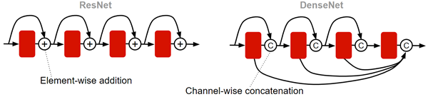 
 
For the final model we chose DenseNet style because of its advantages:

* Strong gradient flow
* Strong feature propagation
* Less parameters
* Feature reuse

## Building blocks: Layer

The Layer block has this structure:

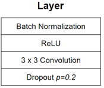 
 
It is implemented in /pyramidal/blocks/densenet/layer.py

## Building blocks: DenseBlock

The DenseBlock is made of Layers following this arrangement:

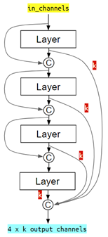 

 
Each layer produces k features, typically 16 or 24, that are concatenated following the patterns shown in the figure. This figure shows a DenseBlock of 4 layers but it can be extended in a similar way to 5, 7, 10 or whatever number of layers.

The DenseBlocks for different number of layers are implemented in /pyramidal/blocks/densenet/denseblockX.py, where X is the number of layers.

## Building blocks: Transitions Down & Up

The down and up transitions are blocks that downsample (/2) and upsample (x2) the feature maps to progress from one level to the next one through the pyramidal model:

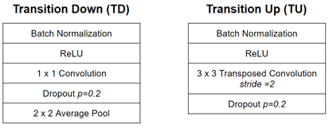 

We can implement these blocks in several ways. For example, the TD blocks can be implemented with average pools or max pools. The TU blocks can be implemented with transposed convolutions with stride=2 or with features upsamplings and convolutions.

Several methods are implemented in /pyramidal/blocks/densenet/down_X.py and up_X.py scripts. We can implement factory patterns (from Object Oriented Programming paradigms) to choose our preferred one. For example, when we need to add a transition down to the model, we ask a factory object to provide us with a new module instead of hard coding it. Change the factory object and all the transitions will change accordingly.

## Final experiment

This is our most advanced model for the final pyramidal experiment:

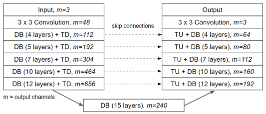 
 
* Encoder to the left: DenseNet Blocks (DB) and Transition Downs (TB).
* Decoder to right: DenseNet Blocks and Transition Ups (TU).
* Skip connections at each resolution level.
* m: the number of features after each block.
* Number of layers: 1 + 4 + 5 + 7 + 10 + 12 + 15 + 12 + 10 + 7 + 5 + 4 + 1 + 5 x TD + 5 x TU = 103!!!
* Without all the skip connections we have seen so far (those from the pyramidal architecture itself and those from inside the DenseNet Blocks) it would have been impossible for the gradient to flow.

The final model is implemented in /pyramidal/autoencoders/densenet/pyramidal457101215.py

## Training strategy

This figure summarizes our training strategy:

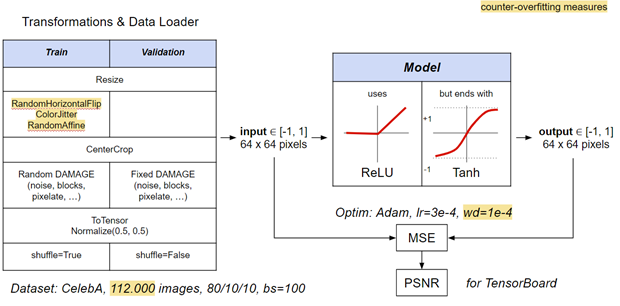
 
* During training we apply some random transformations for Data Augmentation.
* We normalize the images to float32 from -1 to 1. We think this approach will produce good non-linearities with the ReLUs inside the model.
* The activation functions inside the model are ReLUs, except for the last one which is a Tanh for getting an output again from -1 to 1.
* Loss function is MSE.
* Optimizer: Adam with weight decay for a bit of L2 regularization.
* Dataset: CelebA, more than one hundred thousand images, 80% for training, batch size 100.

## Training code

* The main entry points for the different experiments are in the folder /pyramidal/main/celeba. Here we can find several runnable scripts such as:
    * noise.py
    * pixelate.py
    * block.py
    * squares.py
    * blur.py
    * jpeg.py
* common.py contains code that is common to all the experiments.
* hparams.py contains hyper parameters that are common to all the experiments.
* In /pyramidal/train/trainer.py there is the main training loop.
* In /pyramidal/utils/transforms.py there are some transformations that are used for damaging the input images (with noise, blurring, pixelation, blocks, etc).

## Training monitoring

We use TensorBoard to show the progress of the loss function (training and validation). The loss is shown as PSNR because we are more used to it coming from classic image processing. All experiments are recorded with a different name based on date and time to keep track of all of them:

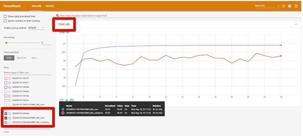

We also use TensorBoard to save some images resulting from the training:

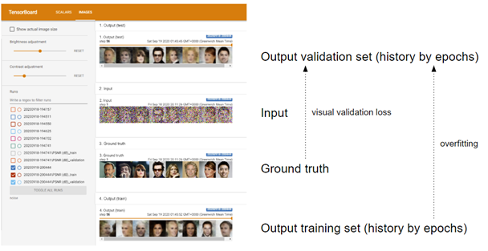

* Some samples for each epoch from the output of the training with the validation set.
* Some samples for each epoch from the output of the training with the training set. By comparing these with the ones from the validation set, we could check visually the impact of an eventual overfitting.
* Some samples from the input.
* Some samples from the ground truth. By comparing these with the output of the training with the validation set we get a visual measure of the validation loss.

## Results (1/4): Massive noise
 
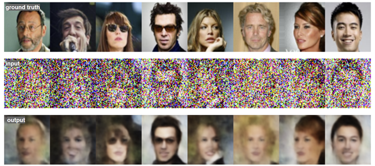

## Results (2/4): Face Blocking
 
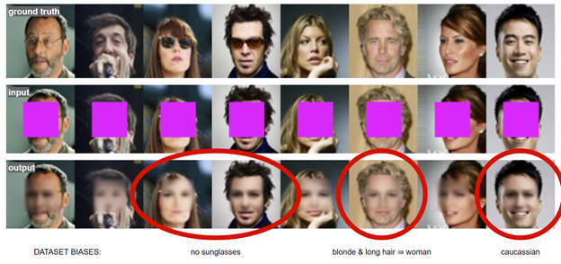

To note: the dataset is biased towards caucassian and no sunglasses, and this is reflected in the output. Also, the model thinks that blonde and long hair equals woman.

## Results (3/4): Super Resolution (x8)

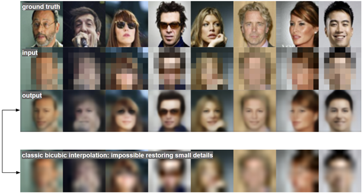

Interesting comparison at the bottom between autoencoder and classical bilinear interpolation. Autoencoder can guess small details that otherwise would be impossible. Later we will explain a totally different approach with GANs.

## Results (4/4): Others

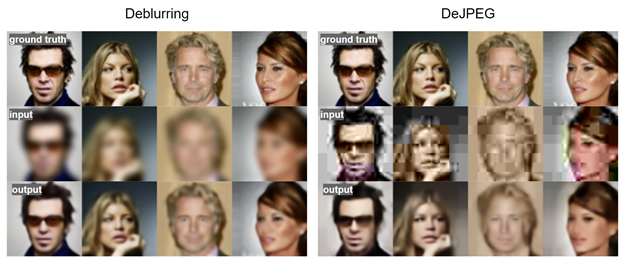

The options are endless: just by training the autoencoder model with different data we get different applications.

## Conclusions

1. Pyramidal architectures **EXIST & WORK**: U-net, Wave-U-net, this project, etc.

1. **SKIP CONNECTIONS** must be used to prevent vanishing gradient (pyramidal, ResNet, DenseNet, etc).

1. **DATA** is very important in AI/DL.

    1. One architecture can fit different applications by just feeding different data: denoising, restoring damages, super-resolution, deblurring, removing text, etc.
    1. But be careful with data: can produce biases.

1. **AI/DL is EXPENSIVE** in time for running tests and resources. It involves not only programming but dealing with data, resources and experimentation as well, but that makes it altogether really exciting.

    1. Tests run on Amazon AWS EC2 with Nvidia Tesla V100 16 GB (500 €)
    1. Prototyping on laptop with Nvidia GTX 1650 4 GB

## Bibliography

* [Residual blocks — Building blocks of ResNet](https://towardsdatascience.com/residual-blocks-building-blocks-of-resnet-fd90ca15d6ec)
* [An Overview of ResNet and its Variants](https://towardsdatascience.com/an-overview-of-resnet-and-its-variants-5281e2f56035)
* [Review: DenseNet — Dense Convolutional Network (Image Classification)](https://towardsdatascience.com/review-densenet-image-classification-b6631a8ef803)
* [DenseNet](https://towardsdatascience.com/densenet-2810936aeebb)


