# Pyramidal Architectures in Autoencoders for Image Restoration

## Hypothesis

> We think that pyramidal architectures in autoencoders can work well for image restoration, can’t they?

The figure below shows what a pyramidal autoencoder looks like:

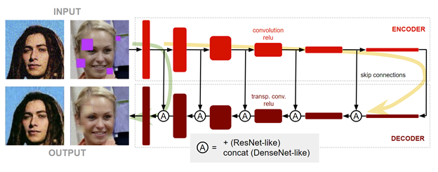

The encoder is made of several convolutional stages that progressively downsample the damaged (noise, holes, blurring, etc) input image size and produce a bottleneck of features that the decoder uses to reconstruct the undamaged ground truth image. The key point of the pyramidal architecture is the skip connections that flow from the encoder to the decoder after each intermediate stage to help the flow of features at different resolution levels:

* The shallow paths learn local features at pixel neighborhood level.
* The deep paths learn abstract features with large receptive field at image size level.
* And all of them collaborate to restore the ground truth image.

## Summer break experiments & conclusions

To verify our hypothesis, we designed and trained several pyramidal models and compared them to their basic nonpyramidal counterparts. All of these models can be found inside /pyramidal/autoencoders: basic21.py, basic22.py, basic51.py, basic51.py, pyramidal51.py, pyramidal51cat.py and pyramidal52.py.

Some results of these models are shown and commented below:

### Ground Truth

 
### Input Image

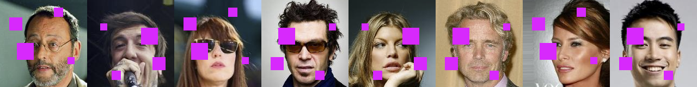 

### Basic21 model

 
 
This is a non-pyramidal shallow model. Pixel details are well captured but larger structures like the purple squares cannot be reconstructed because of the lack of enough receptive field. This model could work for restoring small noise but not this.

### Basic51 model

 
 
This is a non-pyramidal deep model. Now we have an enough large receptive field to restore the purple boxes completely, but the bottleneck of features is so deep that we loss pixel level details

### Pyramidal51 model

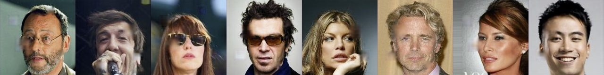 

Finally, this is a pyramidal model. It has a large receptive field but also performs good reconstruction at the fine pixel level details. In short, it combines the benefits of Basic21 and Basic51 in a single model.

These results confirm our hypothesis about the benefits of using pyramidal architectures in autoencoders.

## New hypothesis

But what would happen if we had more massive damages into the input images like these ones?

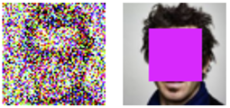 
 
In this case, we need more convolutional layers in our model for being able to learn more but, the more layers, the greater the vanishing gradient problem:
 
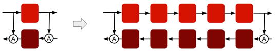 

So our new hypothesis for going further is:

> We can use a high number of convolutional layers in a pyramidal autoencoder if we add more skip connections like in ResNet or DenseNet architectures to help the gradient flow.

## New experiment

For increasing the number of layers, we have studied and implement ResNet and DenseNet techniques:

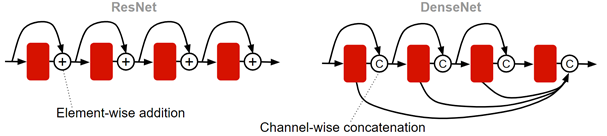 
 
For the final model we chose DenseNet style because of its advantages:

* Strong gradient flow
* Strong feature propagation
* Less parameters
* Feature reuse

## Building blocks: Layer

The Layer block has this structure:

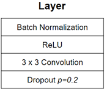 
 
It is implemented in /pyramidal/blocks/densenet/layer.py

## Building blocks: DenseBlock

The DenseBlock is made of Layers following this arrangement:

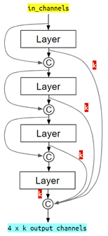 

 
Each layer produces k features, typically 16 or 24, that are concatenated following the patterns shown in the figure. This figure shows a DenseBlock of 4 layers but it can be extended in a similar way to 5, 7, 10 or whatever number of layers.

The DenseBlocks for different number of layers are implemented in /pyramidal/blocks/densenet/denseblockX.py, where X is the number of layers.

## Building blocks: Transitions Down & Up

The down and up transitions are blocks that downsample (/2) and upsample (x2) the feature maps to progress from one level to the next one through the pyramidal model:

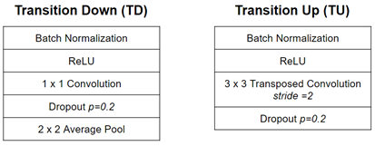 

We can implement these blocks in several ways. For example, the TD blocks can be implemented with average pools or max pools. The TU blocks can be implemented with transposed convolutions with stride=2 or with features upsamplings and convolutions.

Several methods are implemented in /pyramidal/blocks/densenet/down_X.py and up_X.py scripts. We can implement factory patterns (from Object Oriented Programming paradigms) to choose our preferred one. For example, when we need to add a transition down to the model, we ask a factory object to provide us with a new module instead of hard coding it. Change the factory object and all the transitions will change accordingly.

## Final experiment

This is our most advanced model for the final pyramidal experiment:

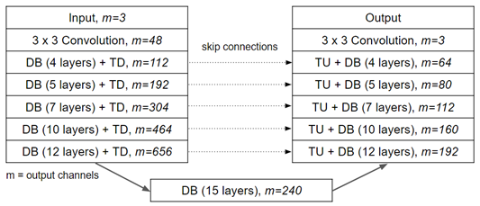 
 
* Encoder to the left: DenseNet Blocks (DB) and Transition Downs (TB).
* Decoder to right: DenseNet Blocks and Transition Ups (TU).
* Skip connections at each resolution level.
* m: the number of features after each block.
* Number of layers: 1 + 4 + 5 + 7 + 10 + 12 + 15 + 12 + 10 + 7 + 5 + 4 + 1 + 5 x TD + 5 x TU = 103!!!
* Without all the skip connections we have seen so far (those from the pyramidal architecture itself and those from inside the DenseNet Blocks) it would have been impossible for the gradient to flow.

The final model is implemented in /pyramidal/autoencoders/densenet/pyramidal457101215.py

## Training strategy

This figure summarizes our training strategy:

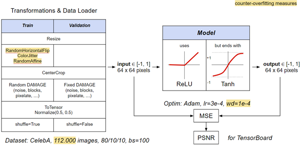
 
* During training we apply some random transformations for Data Augmentation.
* We normalize the images to float32 from -1 to 1. We think this approach will produce good non-linearities with the ReLUs inside the model.
* The activation functions inside the model are ReLUs, except for the last one which is a Tanh for getting an output again from -1 to 1.
* Loss function is MSE.
* Optimizer: Adam with weight decay for a bit of L2 regularization.
* Dataset: CelebA, more than one hundred thousand images, 80% for training, batch size 100.

## Training code

* The main entry points for the different experiments are in the folder /pyramidal/main/celeba. Here we can find several runnable scripts such as:
    * noise.py
    * pixelate.py
    * block.py
    * squares.py
* common.py contains code that is common to all the experiments.
* hparams.py contains hyper parameters that are common to all the experiments.
* In /pyramidal/train/trainer.py there is the main training loop.
* In /pyramidal/utils/transforms.py there are some transformations that are used for damaging the input images (with noise, blurring, pixelation, blocks, etc).

## Training monitoring

We use TensorBoard to show the progress of the loss function (training and validation). The loss is shown as PSNR because we are more used to it coming from classic image processing. All experiments are recorded with a different name based on date and time to keep track of all of them:

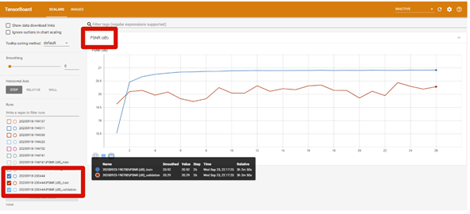

We also use TensorBoard to save some images resulting from the training:

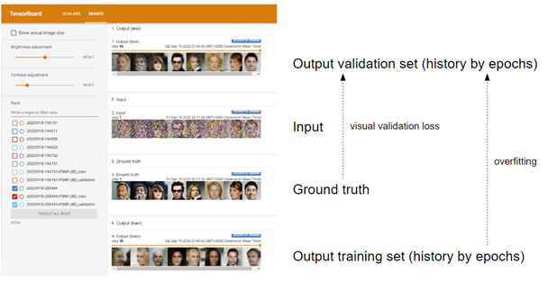

* Some samples for each epoch from the output of the training with the validation set.
* Some samples for each epoch from the output of the training with the training set. By comparing these with the ones from the validation set, we could check visually the impact of an eventual overfitting.
* Some samples from the input.
* Some samples from the ground truth. By comparing these with the output of the training with the validation set we get a visual measure of the validation loss.

## Results (1/3): Massive noise
 
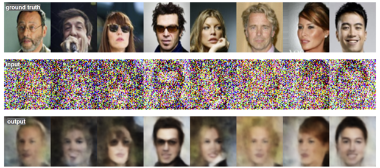

## Results (2/3): Face Blocking
 
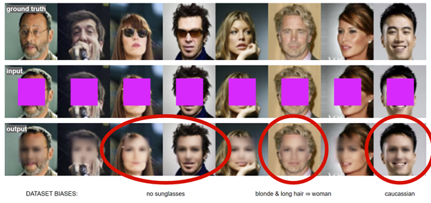

To note: the dataset is biased towards caucassian and no sunglasses, and this is reflected in the output. Also, the model thinks that blonde and long hair equals woman.

## Results (3/3): Super Resolution (x8)

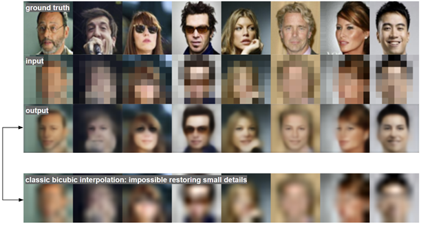

Interesting comparison at the bottom between autoencoder and classical bilinear interpolation. Autoencoder can guess small details that otherwise would be impossible. Later we will explain a totally different approach with GANs.

## Conclusions

1. Pyramidal architectures **EXIST & WORK**: U-net, Wave-U-net, this project, etc.

1. **SKIP CONNECTIONS** must be used to prevent vanishing gradient (pyramidal, ResNet, DenseNet, etc).

1. **DATA** is very important in AI/DL.

    1. One architecture can fit different applications by just feeding different data: denoising, restoring damages, super-resolution, deblurring, removing text, etc.
    1. But be careful with data: can produce biases.

1. **AI/DL is EXPENSIVE** in time for running tests and resources. It involves not only programming but dealing with data, resources and experimentation as well, but that makes it altogether really exciting.

    1. Tests run on Amazon AWS EC2 with Nvidia Tesla V100 16 GB (500 €)
    1. Prototyping on laptop with Nvidia GTX 1650 4 GB

